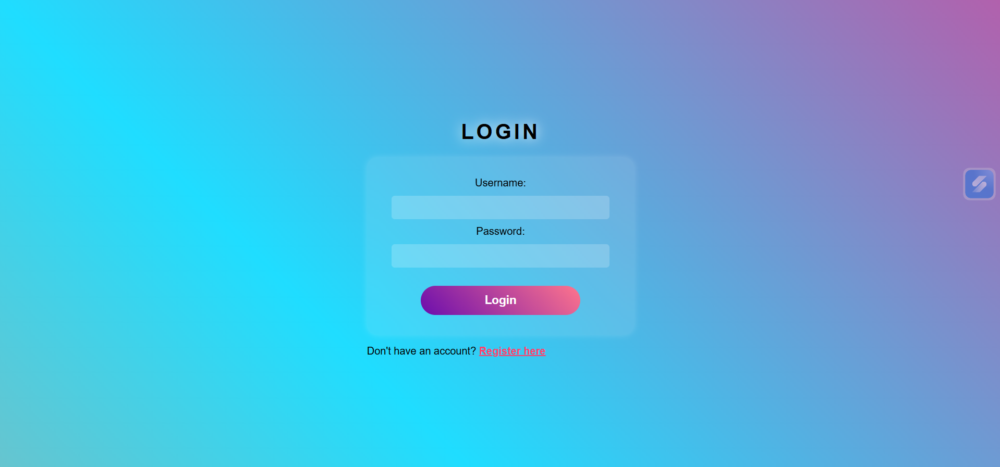
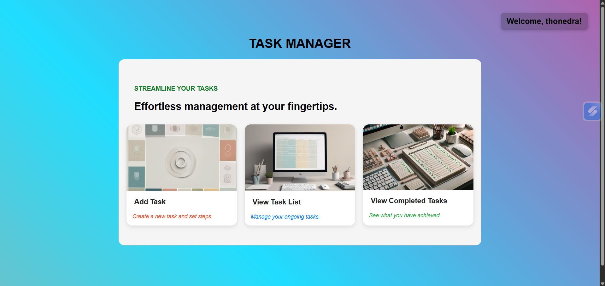
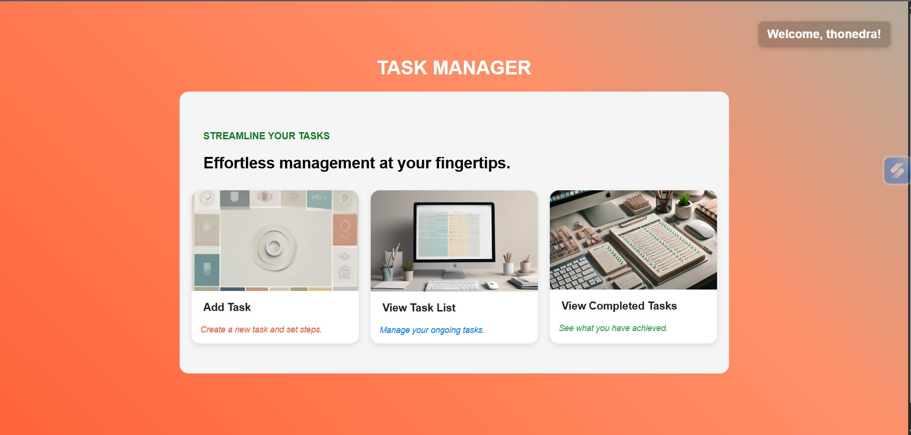
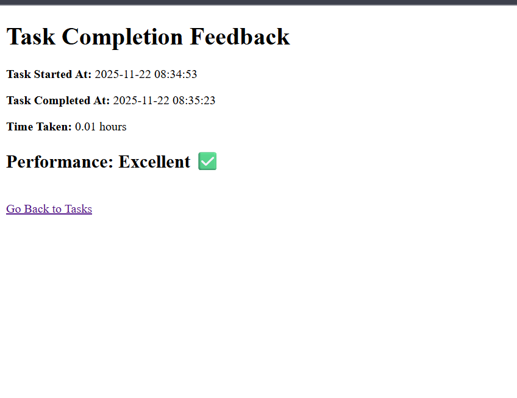

# TO DO LIST APP
A full-stack web application for task management with user authentication, task breakdown into steps, and performance feedback.

## 🛠️ Tech Stack

Frontend: HTML5, CSS3, JavaScript
Backend: Python, Flask, Jinja2
Database: MySQL
Authentication: Flask Sessions

## 🚀 Features

User registration & login
Create tasks with due dates
Break tasks into steps with difficulty levels
Mark tasks/steps as complete
Performance feedback based on completion time
Responsive design

## Application Screenshots

The user will login here, the color theme is like, two gradient colors switching one after another.

### The index page, main page, where user will 
ADD: a particular task by defining the due date, deathline and smaller steps or modules to complete the main task.
Watch: the remaining tasks need to be completed in upcoming period.
List: the finished tasks with their dates and detailed infos.

### When defining a particular task, we can add steps based on their difficulty( optional ) and a task with steps need to complete all those steps first. Otherwise, the button is disabled.

### When mark as complete, it will generate a kind of reflection and review on, how the user had surpassed this task. Durations, efficiency and rating are given. 

#### Name  - thonedra
#### Email - thonedra.dev@gmail.com
#### Phone - 0182128530

