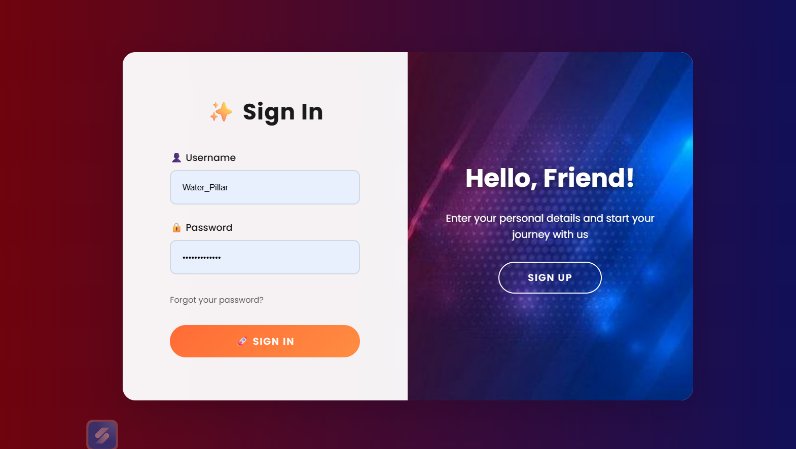

# 📝 Flask Task Manager

<div align="center">


**A dynamic, feature-rich Task Management System built with Flask and MySQL.** Track workflows, break tasks into steps, and get performance feedback with a sleek, responsive UI.

[Report Bug](mailto:thonedra.dev@gmail.com) · [Request Feature](mailto:thonedra.dev@gmail.com)

</div>

---

## 🚀 About The Project

This Task Manager is designed to go beyond simple "to-do" lists. It focuses on **workflow granularity** by allowing users to break main tasks into smaller, manageable steps with varying difficulty levels. 

It features a modern UI with **Dark/Light mode**, real-time due date tracking, and a **gamified feedback system** that rates your performance based on how quickly you complete tasks.

### ✨ Key Features

* **🔐 User Authentication:** Secure Login and Registration system with session management.
* **🌗 Theme Toggle:** Persisted Dark and Light mode preference.
* **📋 Granular Task Management:**
    * Create tasks with specific Due Dates.
    * Break tasks down into **Sub-steps** (Easy, Normal, Hard, Insane).
    * Track progress of individual steps before finishing the main task.
* **📊 Performance Feedback:**
    * Automatic calculation of time taken.
    * Rating system (Excellent, Good, Normal, Need Work) based on completion speed.
    * Celebratory animations (Confetti) upon completion.
* **⏰ Time Tracking:** Visual indicators for "Days Left" or "Overdue" status.
* **📱 Responsive Design:** Clean interface built with vanilla CSS and JavaScript.

---

## 🛠️ Built With

The application is built using a robust, lightweight stack:

* **Backend:**  
* **Database:** 
* **Frontend:**   

---

## 📸 Screenshots

| Login & Registration | Task Creation Workflow |
|:--------------------:|:----------------------:|
|  |  |
| **Secure entry with session handling** | **Intuitive Multi-step Modal** |

| Task Details & Steps | Completion Feedback |
|:--------------------:|:-------------------:|
|  |  |
| **Manage deadlines and sub-steps** | **Performance rating & insights** |

---

## ⚡ Getting Started

Follow these steps to set up the project locally.

### Prerequisites

* Python 3.x
* MySQL Server (or XAMPP/WAMP)

### Installation

1.  **Clone the repository**
    ```sh
    git clone [https://github.com/yourusername/task-manager.git](https://github.com/yourusername/task-manager.git)
    cd task-manager
    ```

2.  **Install dependencies**
    ```sh
    pip install flask mysql-connector-python
    ```

3.  **Database Setup**
    Create a database named `todolist` in MySQL and run the following SQL to create the necessary tables:

    ```sql
    CREATE DATABASE todolist;
    USE todolist;

    CREATE TABLE users (
        id INT AUTO_INCREMENT PRIMARY KEY,
        username VARCHAR(100) NOT NULL UNIQUE,
        position VARCHAR(100),
        age INT,
        gender VARCHAR(20),
        password VARCHAR(255) NOT NULL
    );

    CREATE TABLE tasks (
        id INT AUTO_INCREMENT PRIMARY KEY,
        user_id INT,
        task TEXT NOT NULL,
        completed TINYINT(1) DEFAULT 0,
        due_date DATE,
        created_at TIMESTAMP DEFAULT CURRENT_TIMESTAMP,
        FOREIGN KEY (user_id) REFERENCES users(id)
    );

    CREATE TABLE steps (
        sid INT AUTO_INCREMENT PRIMARY KEY,
        fid INT,
        task VARCHAR(255),
        step_description TEXT,
        difficulty VARCHAR(50),
        status TINYINT(1) DEFAULT 0,
        FOREIGN KEY (fid) REFERENCES tasks(id)
    );

    CREATE TABLE completed_tasks (
        cid INT AUTO_INCREMENT PRIMARY KEY,
        fid INT,
        task TEXT,
        completed_at DATETIME
    );
    ```

4.  **Configure Database Connection**
    Update `backend.py` and `user.py` with your MySQL credentials:
    ```python
    mysql.connector.connect(
        host="localhost",
        user="root",
        password="your_password", -- Update this
        database="todolist",
        port=4306 -- Update based on your configuration
    )
    ```

5.  **Run the Application**
    ```sh
    python backend.py
    ```
    Access the app at `http://127.0.0.1:5000`

---

## 📬 Contact

**Thonedra** 📧 **Email:** [thonedra.dev@gmail.com](mailto:thonedra.dev@gmail.com)

I am currently open to collaboration, freelance opportunities, or discussing innovative web solutions. If you find this project interesting or have an idea you'd like to build together, please don't hesitate to reach out!

---

<div align="center">
    <p>⭐️ <b>Star this repository if you find it helpful!</b> ⭐️</p>
</div>