<!-- ═══════════════════════════════════════════════════════════════════════
     TaskFlow · README
     Animated assets live in /.github/assets — the rest is plain GitHub Markdown.
     ═══════════════════════════════════════════════════════════════════════ -->



 

  

 

**[✦ Overview](#-overview)** &nbsp;·&nbsp;
**[✦ Gallery](#-gallery)** &nbsp;·&nbsp;
**[✦ Features](#-features)** &nbsp;·&nbsp;
**[✦ Architecture](#-architecture)** &nbsp;·&nbsp;
**[✦ Stack](#-tech-stack)** &nbsp;·&nbsp;
**[✦ Roadmap](#-roadmap)**

## ✦ Overview

> *"Three apps for one workday is two too many."*

**TaskFlow** began in early 2025 as a humble to-do list inspired by tools like **ClickUp**, and grew into a single, cohesive workspace where **tasks**, **meetings**, and **multi-person projects** live side by side.

It isn't a CRUD demo wearing a costume. TaskFlow ships with its own design language, built to feel like a real product from the first screen:

<table>
<tr>
<td width="33%" valign="top">

### 🪟 Glass
A **glassmorphism UI** with frosted panels, soft depth and luminous gradients.

</td>
<td width="33%" valign="top">

### 🌗 Dual-theme
Full **dark / light parity** on every screen, not just the landing page.

</td>
<td width="33%" valign="top">

### 🧊 Playful 3D
Draggable **2.5D / 3D characters** powered by Three.js and react-three-fiber.

</td>
</tr>
</table>

## ✦ Gallery

> Every screen below is real, shipped UI — click a section to expand it.

<b>🔐 &nbsp;Authentication &nbsp;·&nbsp; Google OAuth 2.0, email &amp; password, 6-digit OTP</b>

 

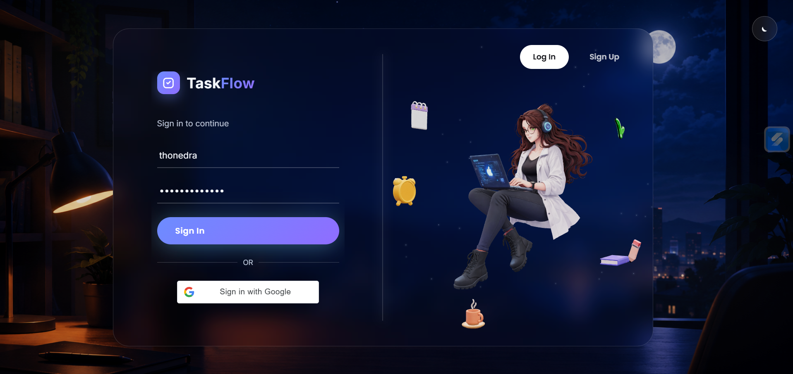
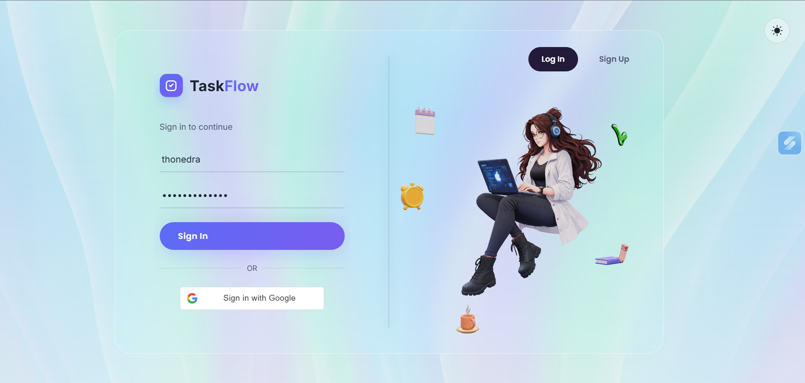
 <b>Sign in</b> — identical experience in dark <i>and</i> light
  
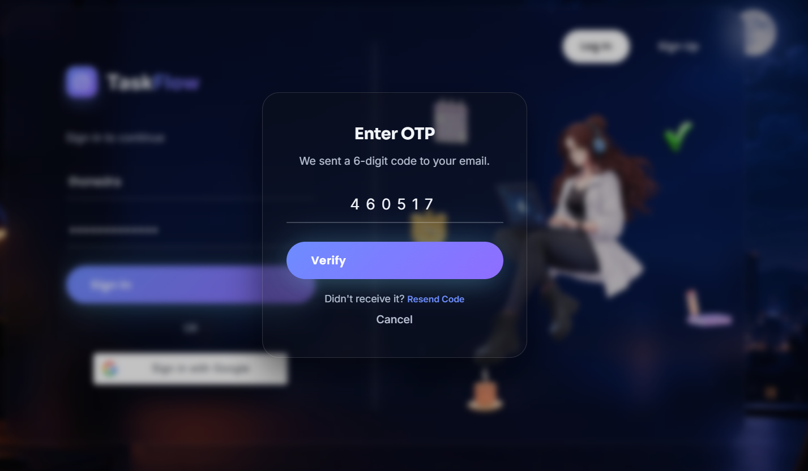
 <b>Email verification</b> — a clean, step-based 6-digit OTP flow

<b>📊 &nbsp;Dashboard &nbsp;·&nbsp; stats, live task creation, progress ring</b>

 

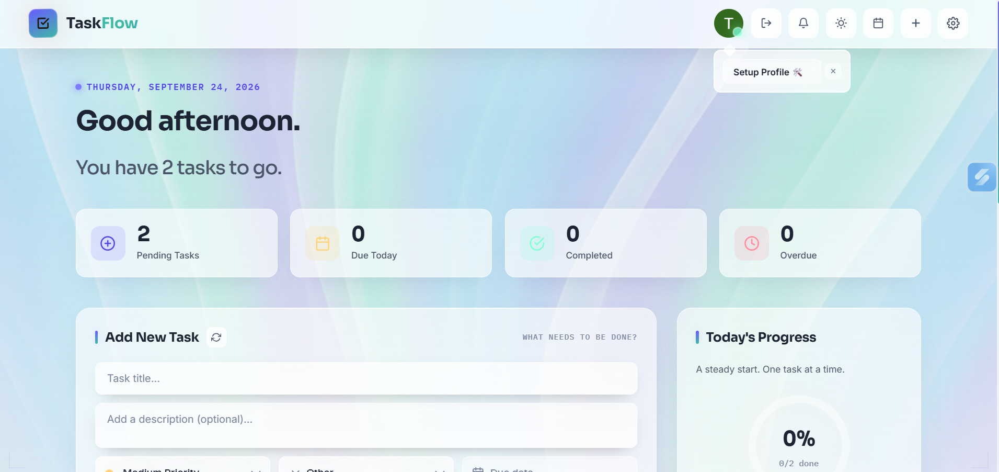
 <b>Dark</b>
  
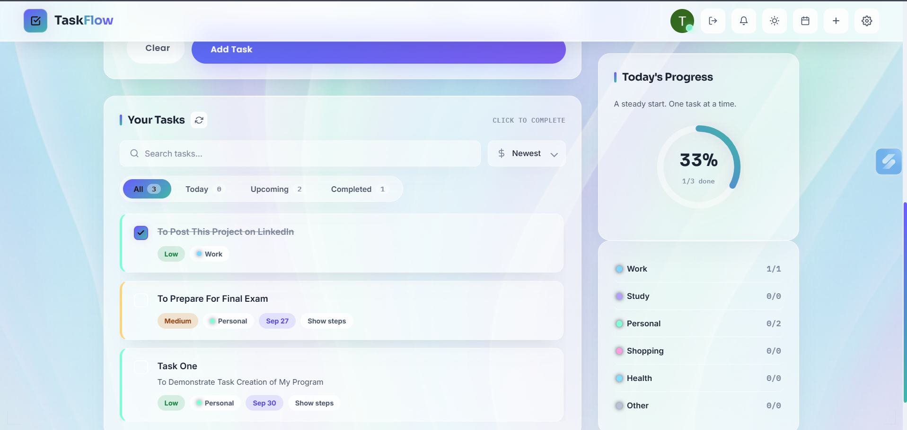
 <b>Light</b>

 

At-a-glance counters for **pending · due today · completed · overdue**, a live task-creation form, and a **progress ring that updates in real time**.

<b>🗓️ &nbsp;Calendar &nbsp;·&nbsp; tasks, project work &amp; meetings in one view</b>

 

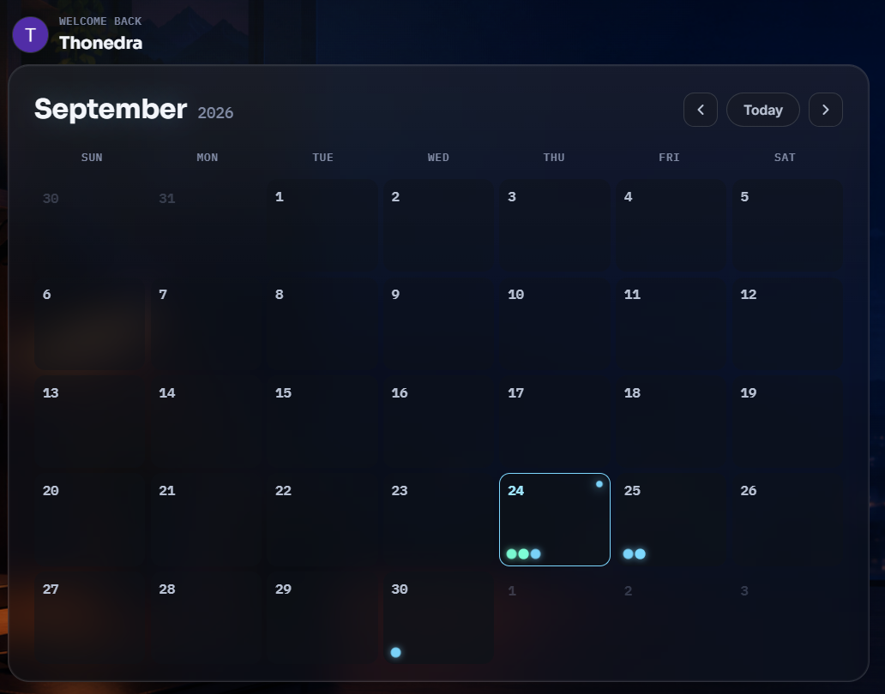
 <b>Monthly view</b> with an illustrated character guide &amp; legend
  
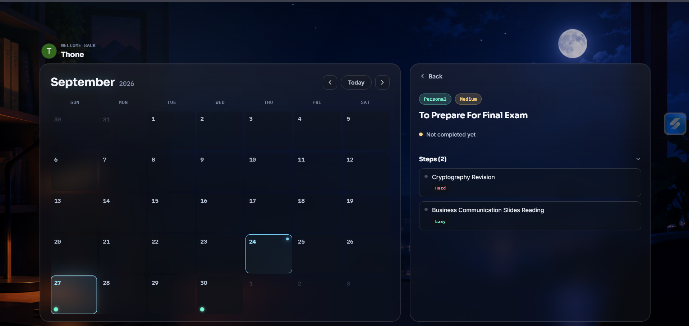
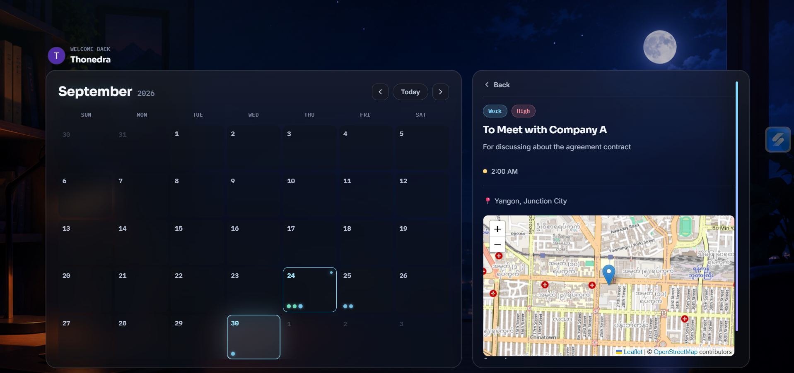
 <b>Task detail</b> &nbsp;·&nbsp; <b>Meeting detail</b> — steps, agenda &amp; location, without leaving the calendar
  
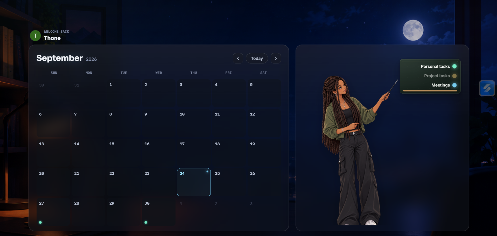
 <b>Metadata panel</b>

<b>📁 &nbsp;Projects &nbsp;·&nbsp; a guided two-step creation flow</b>

 

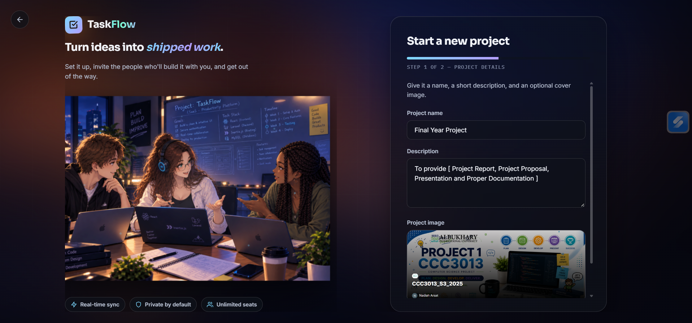
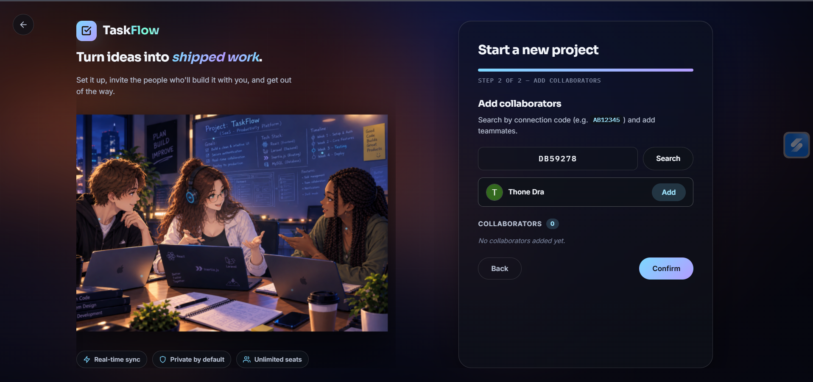
 <b>Step 1</b> — name, description, cover &nbsp;·&nbsp; <b>Step 2</b> — invite your team

<b>🔔 &nbsp;Notifications &nbsp;·&nbsp; a proper inbox, not an afterthought</b>

 

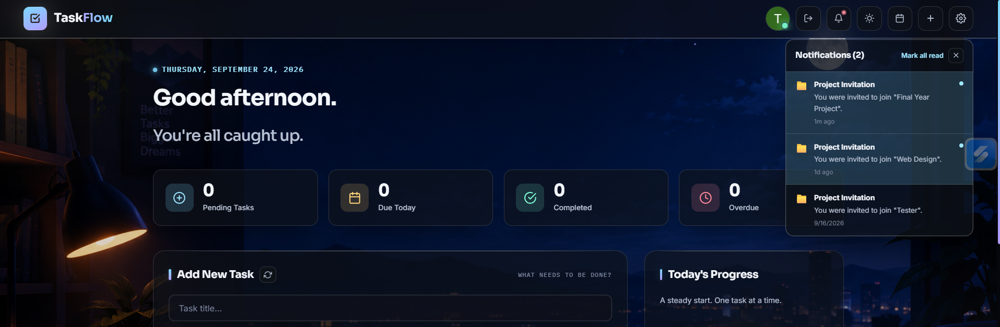
 Unread counts · mark-as-read · mark-all-read — from the bell in the top nav

## ✦ Features

<table>
<tr>
<td width="50%" valign="top">

#### 🔐 Secure Authentication
Google OAuth 2.0, email OTP verification, and a guided multi-step profile setup.

#### ✅ Task Management
Create, update and complete tasks with **steps, priorities, categories and due dates**.

#### 🤝 Meeting Management
Schedule meetings with **locations, participants and agendas**, plus map-based venues.

#### 📁 Project Collaboration
Spin up projects and invite collaborators with **invitation codes**.

</td>
<td width="50%" valign="top">

#### 🔔 Notification System
Automated in-app reminders for upcoming and overdue items.

#### 📧 Email Notifications
Optional automated email delivery for key updates.

#### 🗺️ Map Integration
Embedded **Leaflet** maps for geocoded meeting locations.

#### 🎨 Theming &nbsp;+&nbsp; 🧊 3D / 2.5D Visuals
Full dark/light mode on every screen, and interactive, draggable animated elements built with **Three.js** &amp; **react-three-fiber**.

</td>
</tr>
</table>

## ✦ Architecture

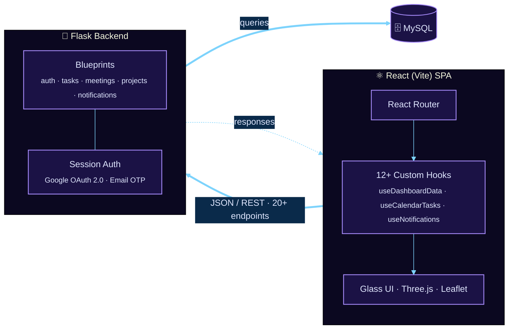
```mermaid
%%{init: {'theme':'base','themeVariables':{
  'primaryColor':'#1b1245','primaryTextColor':'#e0e7ff','primaryBorderColor':'#a78bfa',
  'lineColor':'#7dd3fc','secondaryColor':'#0a2a4a','tertiaryColor':'#0b0820',
  'fontFamily':'ui-sans-serif, system-ui'}}}%%
flowchart LR
  subgraph FE["⚛️  React (Vite) SPA"]
    direction TB
    R["React Router"]
    H["12+ Custom Hooks<br/><sub>useDashboardData · useCalendarTasks · useNotifications</sub>"]
    UI["Glass UI · Three.js · Leaflet"]
    R --> H --> UI
  end

  subgraph BE["🐍  Flask Backend"]
    direction TB
    BP["Blueprints<br/><sub>auth · tasks · meetings · projects · notifications</sub>"]
    SA["Session Auth<br/><sub>Google OAuth 2.0 · Email OTP</sub>"]
    BP --- SA
  end

  DB[("🗄️  MySQL")]

  FE == "JSON / REST · 20+ endpoints" ==> BE
  BE == "queries" ==> DB
  BE -. "responses" .-> FE

  classDef box fill:#1b1245,stroke:#a78bfa,color:#e0e7ff,stroke-width:1.5px;
  class R,H,UI,BP,SA,DB box;
```

<table>
<tr>
<td width="33%" valign="top">

**⚛️ Frontend**

A Vite-powered SPA with client-side routing. A library of **12+ custom hooks** decouples data-fetching, derived state and UI logic.

</td>
<td width="33%" valign="top">

**🐍 Backend**

Flask organized into **blueprints**, exposing **20+ REST endpoints** across auth, tasks, meetings, projects and notifications.

</td>
<td width="33%" valign="top">

**🗄️ Data &amp; Auth**

MySQL with a centralized connection/config module. **Session-based** auth with Google OAuth 2.0 and email OTP as alternate flows.

</td>
</tr>
</table>

## ✦ Tech Stack

| Layer | Tools |
|:---:|:---|
| **Frontend** |       |
| **Backend** |    |
| **Database** |  |
| **Auth** |    |

## ✦ Roadmap

TaskFlow is an evolving MVP. What's next:

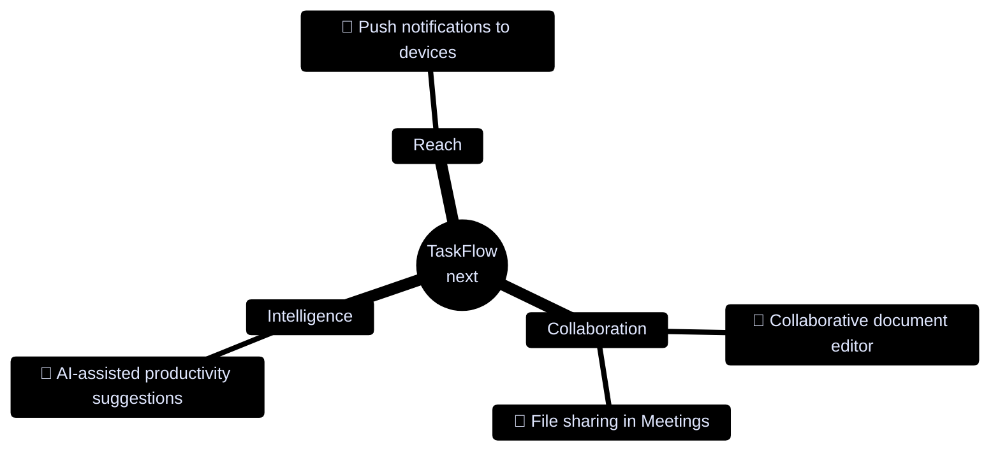
```mermaid
%%{init: {'theme':'base','themeVariables':{'primaryColor':'#1b1245','primaryTextColor':'#e0e7ff','primaryBorderColor':'#a78bfa','lineColor':'#7dd3fc','fontFamily':'ui-sans-serif, system-ui'}}}%%
mindmap
  root((TaskFlow<br/>next))
    Collaboration
      📝 Collaborative document editor
      📎 File sharing in Meetings
    Intelligence
      🤖 AI-assisted productivity suggestions
    Reach
      📱 Push notifications to devices
```

- [ ] 📝 **Collaborative document editor** for multi-person project work
- [ ] 📎 **File sharing** within the Meeting module
- [ ] 🤖 **Personalized AI-assisted** productivity suggestions
- [ ] 📱 **Push notifications** to user devices

## ✦ License

Released under the **MIT License** — build on it, remix it, make it yours.

 

**Crafted with ❤️ and a lot of ☕ by [thonedra-dev](https://github.com/thonedra-dev)**

*If TaskFlow inspires you, a ⭐ goes a long way.*

  

