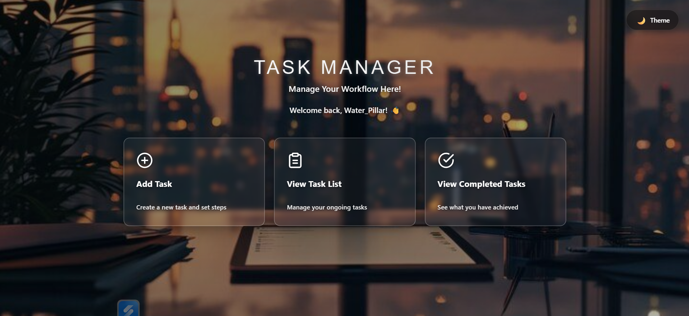
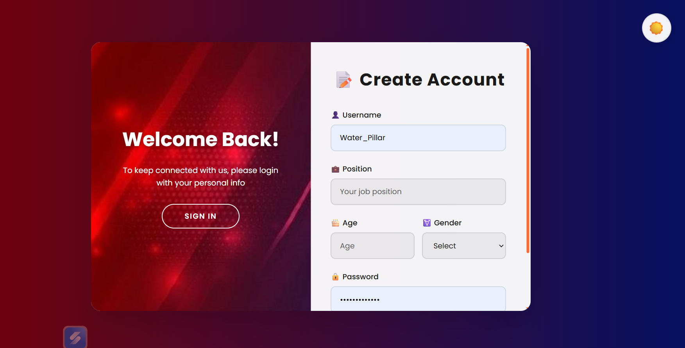
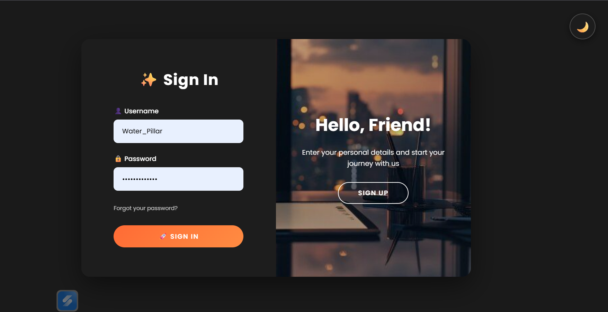
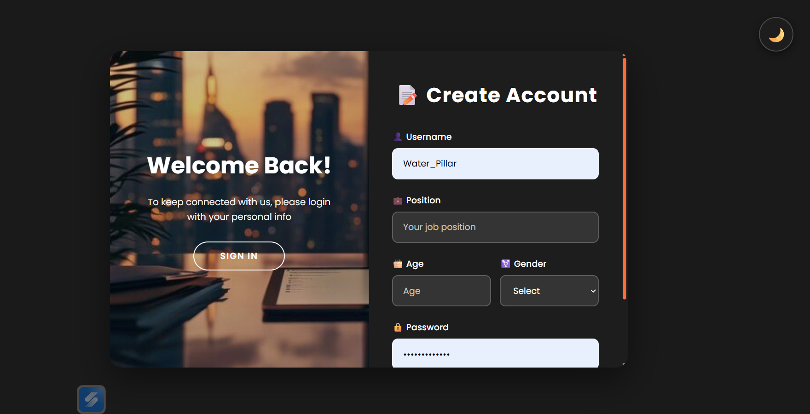

# 📝 Flask Task Manager

<div align="center">



**A dynamic, feature-rich Task Management System built with Flask and MySQL.**  
Track workflows, break tasks into steps, and get performance feedback with a sleek, responsive UI.

</div>

---

## 🚀 About The Project

This Task Manager is designed to go beyond simple "to-do" lists. It focuses on **workflow granularity** by allowing users to break main tasks into smaller, manageable steps with varying difficulty levels.

It features a modern UI with **Dark/Light mode**, real-time due date tracking, and a **gamified feedback system** that rates your performance based on how quickly you complete tasks.

---

## ✨ Key Features

- **🔐 User Authentication:** Secure Login and Registration system with session management.
- **🌗 Theme Toggle:** Persisted Dark and Light mode preference.
- **🔄 Animated Auth Layout:** Smooth **Sign In ↔ Sign Up panel shifting** with form transformation.
- **📋 Granular Task Management:**
  - Create tasks with specific Due Dates.
  - Break tasks down into **Sub-steps** (Easy, Normal, Hard, Insane).
  - Track progress of individual steps before finishing the main task.
- **📊 Performance Feedback:**
  - Automatic calculation of time taken.
  - Rating system (Excellent, Good, Normal, Need Work) based on completion speed.
  - Celebratory animations (Confetti) upon completion.
- **⏰ Time Tracking:** Visual indicators for "Days Left" or "Overdue" status.
- **📱 Responsive Design:** Clean interface built with vanilla CSS and JavaScript.

---

## 🎨 Auth UI (Animated Shift + Light/Dark Themes)

The authentication interface is designed with a **two-panel sliding layout**, giving it a modern product-like feel.

### 🔄 Smooth Sign In ↔ Sign Up Transition

- The **Sign In form** starts on one panel while the opposite panel shows the **Sign Up prompt**.
- When you click **Sign Up**, the layout **smoothly slides** and the form **transforms** into the Create Account screen.
- Clicking **Sign In** shifts the UI back again with the same smooth animation.
- This behavior works perfectly in both **Light Mode** and **Dark Mode**.

---

## 📸 Authentication Screenshots (Light + Dark)

### ☀️ Light Theme (Animated Shift)

| Sign In | Create Account |
|:------:|:-------------:|
|  |  |

### 🌙 Dark Theme (Animated Shift)

| Sign In | Create Account |
|:------:|:-------------:|
|  |  |

---

## 📸 App Screenshots (Core Features)

### 🧩 Task Creation + Workflow

| Task Creation Workflow | Task Details & Steps |
|:----------------------:|:--------------------:|
|  |  |

### 🎉 Completion Feedback

| Completion Feedback |
|:-------------------:|
|  |

---

## 🛠️ Built With

- **Backend:**  
- **Database:** 
- **Frontend:**   

---

## ⚡ Getting Started

### ✅ Requirements
- Python 3.x
- MySQL Server (or XAMPP/WAMP)

### 🧪 Setup & Run (Full Steps)

```bash
# 1) Clone the repository
git clone https://github.com/yourusername/task-manager.git
cd task-manager

# 2) Install dependencies
pip install flask mysql-connector-python

# 3) Create database and tables (MySQL)
# Open your MySQL client and run:

CREATE DATABASE todolist;
USE todolist;

CREATE TABLE users (
    id INT AUTO_INCREMENT PRIMARY KEY,
    username VARCHAR(100) NOT NULL UNIQUE,
    position VARCHAR(100),
    age INT,
    gender VARCHAR(20),
    password VARCHAR(255) NOT NULL
);

CREATE TABLE tasks (
    id INT AUTO_INCREMENT PRIMARY KEY,
    user_id INT,
    task TEXT NOT NULL,
    completed TINYINT(1) DEFAULT 0,
    due_date DATE,
    created_at TIMESTAMP DEFAULT CURRENT_TIMESTAMP,
    FOREIGN KEY (user_id) REFERENCES users(id)
);

CREATE TABLE steps (
    sid INT AUTO_INCREMENT PRIMARY KEY,
    fid INT,
    task VARCHAR(255),
    step_description TEXT,
    difficulty VARCHAR(50),
    status TINYINT(1) DEFAULT 0,
    FOREIGN KEY (fid) REFERENCES tasks(id)
);

CREATE TABLE completed_tasks (
    cid INT AUTO_INCREMENT PRIMARY KEY,
    fid INT,
    task TEXT,
    completed_at DATETIME
);

# 4) Configure database connection in backend.py and user.py
# Example:
mysql.connector.connect(
    host="localhost",
    user="root",
    password="your_password",
    database="todolist",
    port=4306
)

# 5) Run the application
python backend.py

# Open:
# http://127.0.0.1:5000
